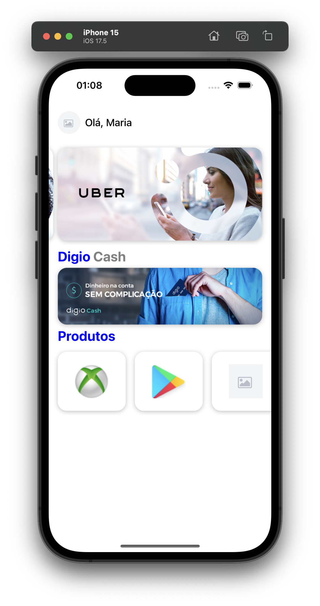

# Digio - iOS Application  

## Visão Geral  

O objetivo deste projeto é utilizar um template fornecido para desenvolver um aplicativo com duas telas:  
1. Uma tela que exibe uma lista de produtos da **Digio Store**.  
2. Uma tela que apresenta os detalhes de um produto.

| Tela         | Descrição                                                                                                     | Imagem                     |
|--------------|-------------------------------------------------------------------------------------------------------------|----------------------------|
| **Home**     | Tela inicial que exibe a lista de produtos disponíveis na **Digio Store**.                                   |    |
| **Detalhes** | Tela de detalhes que apresenta informações detalhadas sobre o produto selecionado. Layout de design livre.  |  |


Segue uma seção detalhada para incluir no README sobre a arquitetura do projeto:

---

## Arquitetura  

O projeto utiliza uma arquitetura baseada no padrão **MVVM-C** (Model-View-ViewModel-Coordinator), incorporando conceitos modernos de programação funcional inspirados pelo **Point-Free Style**.  

### Principais Abordagens  

1. **Protocol Witnesses**  
   - Utilizei o conceito de [Protocol Witnesses](https://www.pointfree.co/collections/protocol-witnesses) para desacoplar comportamentos e facilitar a composição de dependências e funcionalidades.  
   - Essa abordagem permite modelar comportamentos em vez de aderir a uma hierarquia rígida de protocolos, trazendo maior flexibilidade ao código.  

2. **Callback Closures**  
   - Substituí o uso de delegados tradicionais por **callback closures**, simplificando a comunicação entre componentes e reduzindo boilerplate.  
   - Isso resultou em um fluxo mais direto e funcional, favorecendo a legibilidade e manutenção do código.  

3. **Gerenciamento de Dependências**  
   - Adotei um padrão próximo ao [PointFree Dependencies](https://github.com/pointfreeco/swift-dependencies), permitindo injeção explícita de dependências em vez de usar singletons globais.  
   - Isso facilita o teste de unidades isoladas e promove maior controle sobre as dependências do aplicativo.  

---

### Estrutura MVVM-C  

A arquitetura foi organizada seguindo as responsabilidades principais de cada camada:  

| Camada       | Responsabilidade                                                                                           |
|--------------|-----------------------------------------------------------------------------------------------------------|
| **Model**    | Representa os dados e a lógica de negócios. Os modelos são responsáveis por processar e validar informações. |
| **View**     | Componentes de interface do usuário que exibem os dados do ViewModel e encaminham as ações do usuário.     |
| **ViewModel**| Gerencia o estado da View, transforma os dados do Model e prepara as informações para exibição.            |
| **Coordinator** | Gerencia o fluxo de navegação entre as telas e controla o ciclo de vida dos ViewControllers.              |


---

## Dependências  

### SnapKit  

O **SnapKit** é uma biblioteca Swift que facilita a criação de layouts utilizando código. Ele simplifica o uso de **Auto Layout** com uma API declarativa e intuitiva, eliminando a necessidade de trabalhar diretamente com NSLayoutConstraints.  
Utilizei o SnapKit exclusivamente para controle de Auto Layout, garantindo que o layout fosse estruturado de forma eficiente e de fácil manutenção.  

---

## Instalação  

### Pré-requisitos  

- **macOS** com a versão mais recente do **Xcode** instalada.  
- **Tuist** instalado. Caso ainda não possua, você pode instalá-lo com o seguinte comando:  

   ```bash  
   brew tap tuist/tuist  
   brew install tuist  
   ```  

### Configuração  

1. **Baixar Dependências**  

   Use o comando abaixo para instalar as dependências necessárias:  

   ```bash  
   tuist install  
   ```  

2. **Gerar o Projeto Xcode**  

   Gere os arquivos do projeto Xcode com o Tuist:  

   ```bash  
   tuist generate  
   ```  

   Este comando resolverá automaticamente as dependências via **Swift Package Manager (SPM)** e configurará o projeto.  

3. **Abrir o Projeto**  

   Após gerar o projeto, abra-o no Xcode:  

   ```bash  
   open Digio.xcodeproj  
   ```  

4. **Build e Execução**  

   Selecione o dispositivo ou simulador desejado no Xcode e pressione `Cmd + R` para compilar e executar o projeto.  

---

## Estrutura de Projeto com Tuist  

O projeto utiliza o **Tuist** para organizar componentes e módulos, separando claramente as responsabilidades.  

### Componentes Compartilhados  

- Componentes compartilhados são utilizados em diferentes partes do app, como **Autenticação**, **HealthKit** ou **StoreKit**.  
- Para criar um novo componente compartilhado:  

   ```bash  
   tuist scaffold Shared --name <Shared>  
   ```  

   **Exemplo:**  

   ```bash  
   tuist scaffold Shared --name Authentication  
   ```  

   Isso gerará a estrutura básica necessária para o componente.  

### Módulos  

- Módulos representam recursos específicos do aplicativo, como **Configurações**, **Home**, etc.  
- Para criar um novo módulo:  

   ```bash  
   tuist scaffold Module --name <Module>  
   ```  

   **Exemplo:**  

   ```bash  
   tuist scaffold Module --name Home  
   ```  

   Esse comando criará a estrutura básica para o recurso específico.  

### Gerar o Projeto Xcode  

- Após criar os componentes e módulos necessários, gere o projeto com:  

   ```bash  
   tuist generate  
   ```  
